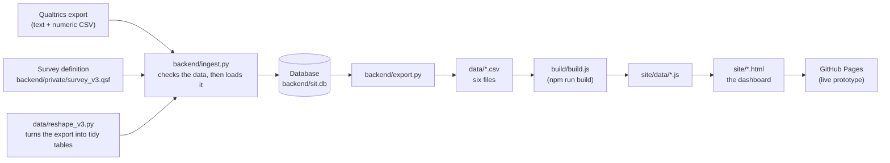

# Handover: STEM Impact Tracker

This is for the GALS team. It assumes you are not a developer. Every step here
was run on a fresh copy of the repository before it was written down. Where
something is unclear from the code, it is listed in
`docs/QUESTIONS_FOR_ARSH.md` and marked here as an open question.

## 1. What exists and where it lives

| Thing | Where | Notes |
|---|---|---|
| The code and the mock data | GitHub: <https://github.com/arsh-dang/Gals-Dashboard> | Public repository. It is under a personal account (`arsh-dang`). See open question 1. |
| The live prototype | <https://arsh-dang.github.io/Gals-Dashboard/> | Built and published by GitHub Pages every time someone pushes to the `main` branch. |
| An older copy | `galsdashboard.netlify.app` | Netlify was used first. The repo still has a `netlify.toml` and the page previews still point at this address. Whether it is still running is unknown. See open question 1. |
| The survey definition | `backend/private/survey_v3.qsf` on Arsh's computer | **Not in the repository.** It stays out until a supervisor confirms it can be public. You need it to load a raw Qualtrics export. |
| The database | `backend/sit.db`, created on your computer when you run the loader | Never committed. Git ignores it. |

**Who has access:** the code does not say. Whoever owns the GitHub repository
and its Pages settings controls the live site. Check this before Friday. See
open question 1.

## 2. How the data flows



In words:

1. Qualtrics gives you two CSV files: one with answers as text, one with answers
   as numbers.
2. `ingest.py` reshapes them into six tidy tables, checks them, and stores them
   in the database as one "wave". It refuses to load anything that is not
   marked as mock data.
3. `export.py` writes the six tables back out as CSV files in `data/`.
4. `npm run build` turns those CSV files into JavaScript files in `site/data/`.
5. The pages in `site/` read those files in the browser. There is no server.
6. Pushing to `main` publishes `site/` to GitHub Pages.

The database step exists so new survey waves can be added with checks, instead
of editing CSV files by hand. The dashboard itself does not need the database.
It only needs `data/*.csv`.

## 3. Common jobs

Run commands from the top folder of the repository. Commands starting with
`python` assume you have set up the Python environment once:

```
python3 -m venv .venv
source .venv/bin/activate
pip install -r backend/requirements.txt
```

### 3.1 Load a new survey wave

**Only do this with mock data.** Real data must not be loaded on this computer
or in this repository. See section 6.

1. Get `survey_v3.qsf` and put it at `backend/private/survey_v3.qsf`. Create the
   folder if it is not there. Git ignores it.
2. Put the two Qualtrics files somewhere in the repository, for example
   `data/raw/mock_v3_text.csv` and `data/raw/mock_v3_numeric.csv`. The first row
   of each file must be the column names, followed by the two Qualtrics header
   rows. Do not delete those rows.
3. Next to the text file, create a small file with the same name plus
   `.meta.json`, for example `data/raw/mock_v3_text.csv.meta.json`:
   ```
   {"is_mock": true, "notes": "Describe where this came from."}
   ```
   Every response id in the file must also start with `R_MK`. Without both,
   the loader refuses.
4. Load the wave. Choose a new wave name each time:
   ```
   python backend/ingest.py --wave-id mock-2026-c --survey-version v3 \
       --text data/raw/mock_v3_text.csv --numeric data/raw/mock_v3_numeric.csv \
       --qsf backend/private/survey_v3.qsf
   ```
5. Read what it prints.
   - `VALIDATION FAILED` means it wrote nothing. The report says which table,
     which row and what is wrong. Fix the file and run it again.
   - A line starting `warning:` does not stop the load. At the moment you will see
     a warning about post-school respondents who have a school value. That is a
     known problem in the mock data (see section 5).
   - `wave ... already exists` means you reused a wave name. Choose a new name,
     or add `--replace` to reload that wave.
6. Write the CSV files the dashboard reads. This overwrites `data/*.csv`:
   ```
   python backend/export.py --waves mock-2026-c --parity
   ```
   `--parity` keeps every value. Use it for mock data. Without it the export
   blanks small groups and some columns (see `backend/export_rules.yaml`). That
   is for files that leave the database, not for feeding this site.
   If you load more than one wave and export them together, each response id gets
   the wave name in front (`mock-2026-b:R_...`), because the same id can appear in
   two waves. The dashboard has no way to compare waves.
7. Rebuild the site and look at it:
   ```
   npm run build
   python3 -m http.server 8000 --directory site
   ```
   Open <http://localhost:8000> and check all three pages.
8. Run the tests:
   ```
   python -m pytest backend/tests
   ```
   Up to three tests in `backend/tests/test_reference.py` will fail if the new
   data no longer matches the saved reference output. Copy the new `data/*.csv`
   files into `backend/tests/fixtures/reference/` if the change is intended. A failing `test_every_label_build_js_looks_up_exists_in_the_csvs`
   means a question or item was renamed. Some chart would draw nothing. See
   section 3.3.
9. Commit and push (section 3.5).

### 3.2 Regenerate the mock data

**Read this first: the generator in the repository does not produce the data
that is currently on the dashboard.** The committed files in `data/raw/` came
from a different version of the generator. Running the repository's generator
gives data where two questions (Q20 and Q21, subject interest and subject
choice) have no answers, so two charts would be empty. Four tests then fail. See
open question 2. Until that is answered, do not replace `data/raw/`.

If you still want to try it, work in the git-ignored folder:

```
cd backend/private
python ../../data/generate_mock_v3.py 200
cd ../..
```

This needs `backend/private/survey_v3.qsf`. The number is how many invented
respondents to make. It writes `mock_v3_text.csv` and `mock_v3_numeric.csv` in
`backend/private`. The script sets a random seed (`SEED = 20260817`), but two
runs in a row gave different data: 194 of the 241 columns differed. So you cannot
recreate a dataset by running it again. Keep the files you like. The cause was not
found. See open question 2. To use the result, copy the two files to `data/raw/`
and follow section 3.1 from step 4.

### 3.3 Change a label

There are three different jobs. Decide which one you have.

**a) Change how a survey answer option is shown, without changing the survey.**
Open `site/js/utils.js`. Find `LABEL_OVERRIDES` and add a line. The left side
must match the survey wording exactly:

```
'Advise from my family': 'Advice from my family',
```

Save the file and refresh the page. You do not need to rebuild. Only what people
see changes. Everything else in the pipeline still uses the original wording.
There is one override already, for "Subjects I need for a future job".

**b) Change words on the page** (headings, captions, notes). Edit the text in
`site/index.html`, `site/teacher.html` or `site/open-text.html`. Some text is
built in JavaScript: look in `site/js/main.js`, `site/js/summary.js`,
`site/js/teacher-main.js` and `site/js/charts/`. Refresh the page to see it.
`wording_review.md` lists the wording rules the project followed (Australian
spelling, "people who answered", "hidden for privacy").

**c) The survey wording itself changed.** The dashboard finds some questions and
options by their exact text. The lists are at the top of `build/build.js`. If the
survey text changes, the data changes, and a chart can silently draw nothing.
After any change, run `npm run build`. It prints `WARNING` lines for the influence
options it cannot find. Then run `python -m pytest backend/tests`. The test that
starts `test_every_label_build_js_looks_up_exists` lists every missing label.
Fix by updating the constants in `build/build.js`, or the question labels in
`data/reshape_v3.py`, so they match.

### 3.4 Change the suppression threshold

Today, any result based on fewer than 5 people is hidden. This is a privacy rule.
Changing it is an ethics decision, not only a technical one. See open question 6.

Change the number in two places:

1. `build/build.js`: the line `const SMALL_CELL_THRESHOLD = 5;`. The pages read
   it from here.
2. `backend/export_rules.yaml`: the line `min_cell: 5`. `export.py` reads it.

Then fix the text that says "5". These are written by hand:

- two bullets in the "About this dashboard" box at the bottom of `site/index.html`
  ("fewer than 5 people" and "at least 5 people");
- the sentence "Counts under 5 are hidden for privacy" in
  `site/js/charts/participation.js` (two places).

Then run `npm run build` and `python -m pytest backend/tests`. Six tests will
fail because they check the number 5. Update them to the new number, in
`backend/tests/test_export.py`. This was tried with the number 3. Nothing else
broke.

### 3.5 Deploy an update

1. Rebuild: `npm run build`.
2. Look at what changed: `git status`.
3. Save and share the change:
   ```
   git add -A
   git commit -m "Say what you changed and why"
   git push origin main
   ```
4. GitHub builds and publishes the site. It takes about a minute. The workflow is
   `.github/workflows/deploy-pages.yml`. It runs `npm ci` and `npm run build` and
   publishes the `site/` folder. It does not run the tests.
5. Check the live site:
   ```
   curl -sI https://arsh-dang.github.io/Gals-Dashboard/ | grep -i last-modified
   ```
   The time should be a minute or two ago. Then open the live site in a private
   window. GitHub Pages lets a browser keep files for 10 minutes, so an old tab can
   show old numbers. A hard refresh fixes it.

If the site does not update, open the repository on GitHub, go to the **Actions**
tab, and look at the last run. The Pages setting (Settings, Pages, Source:
GitHub Actions) must be on. Whether it is on is not visible from the code.

## 4. Decisions made during the project, and why

| Decision | What it means | Where it lives |
|---|---|---|
| **Hide results based on fewer than 5 people** | A group, cell or bar with fewer than 5 people is not drawn. It is marked "hidden for privacy". The number 5 protects small groups from being identified. Why 5 and not another number is not written down. See open question 6. | `build/build.js`, `site/js/utils.js`, `backend/export_rules.yaml` |
| **Mock data only** | Every page has a banner saying so. The loader refuses input that is not marked as mock. Databases and the survey file are git-ignored. The reason: this repository and the site are public. | `site/*.html` banners, `backend/sitdb.py`, `.gitignore` |
| **Scores run 1 = No to 4 = Yes a lot, and higher is better** | Qualtrics codes are the other way round (1 = Yes a lot, 4 = No, 5 = I do not know). The reshape step stores `score = 5 - code`, so a higher average is more positive. Both the code and the score are kept. | `data/reshape_v3.py` (`score`), `docs/DATA_DICTIONARY.md` |
| **"I do not know" is left out of every average** | Its `score` is blank. It counts as a non-answer, not as a low score. Tooltips show how many people said it. | `data/reshape_v3.py`, `site/js/utils.js` |
| **Q107 is reported as "General STEM outcomes"** | The survey has one outcomes question, Q107, that is not tied to an activity. It is shown on its own card and left out of every comparison between activities. It is not treated as an eighth activity. **Open question 3:** the survey file says Q107 is only shown to people who typed something in the "Other (please specify)" activity box. The code assumes it is shown to everyone. | `data/reshape_v3.py` (`BLOCKS`), `build/build.js` (`GENERAL_ACTIVITY_TYPE`) |
| **GitHub Pages instead of Netlify** | Netlify was not picking up new builds, so the team was looking at an old version. Pages builds from `main` on every push and shows what is in the repository. This reason is from Arsh, not from the code. | `.github/workflows/deploy-pages.yml`; `netlify.toml` is still there |
| **No analytics** | No analytics or tracking scripts are on the site, on purpose. One outside request remains: the fonts load from Google Fonts. Open question 12. | `netlify.toml` (comment), `site/css/tokens.css` |
| **One comparison at a time was tried, then reversed** | Commit `03f869d` redesigned every chart to show one activity at a time, to suit phones. The team found the charts too simple, and the commit was reversed (`3896c9c`). The current dashboard shows all activities together, with layouts made for phones. The phone view also has a "One activity" button. Open question 11 asks whether "one activity per chart" is still meant to be a rule. | `site/js/charts/outcomes.js`, `site/index.html` |
| **Wording** | Australian spelling, plain language, "people who answered", "hidden for privacy". Survey wording is shown as asked. | `wording_review.md` |

## 5. Known limitations and open questions

These are real. None of them are hidden by the dashboard's design.

**About the data**

- **The mock data patterns are invented.** The generator builds each person from
  a made-up "persona". It decides who takes part in GALS and gives GALS
  participants the female gender. A gap between GALS and other students, and the
  pattern in the "programme influence" chart, are built in. **Never present any
  mock result as a finding.** The pages say "made-up data" for this reason.
- **GALS participants are all girls.** In the mock data all 65 GALS participants
  answered Female, and this will be true of the real program. So any difference
  between GALS and everyone else is mixed up with gender. The two cannot be
  separated. The notes on the charts say this.
- **Only aggregate patterns are safe to look at.** Do not read anything into a
  single mock respondent.

**About the survey**

- **Q45 is a broken leftover in the Tech school block.** It asks the same "The
  activity helped me to be..." question as the real Tech school table (Q104), but
  as a single-choice question with the answer options as its choices. It has the
  same display logic as Q104. The code ignores Q45 and reads Q104. Open question 8.
- **Three outcome statements exist in two wordings.** The School club or
  lunchtime activity block uses a different wording from the other six blocks for
  three statements. The dashboard shows both as adjacent rows, with a "≈" tag. The
  pairs are listed in `build/build.js` (`ITEM_WORDING_PAIRS`). A comment there
  mentions merging them later with a setting called `MERGE_DUPLICATE_ITEMS`. **That
  setting does not exist in the code.** Merging would be new work.
- **Comfortable or confident?** One of the pairs is "More comfortable working in
  teams" and "More confident in working in teams". The other two pairs differ only
  in word order. This one uses different words, and comfortable and confident may
  not mean the same thing. The code treats them as the same statement. Someone
  should decide. Open question 9.
- **Typos in the survey itself.** For example the first answer of the aspirations
  question is "Yes a lotI", "Advise" is used for "advice", and "specfiy" is
  spelled wrong. The dashboard shows survey wording as asked, so these appear.
  Open question 13.
- **Free-text answers need theme coding.** The "Written answers" page lists
  answers as written. There is a place for themes (`data/open_text_themes.csv`,
  with columns `ResponseId,question,theme`), but the file does not exist and
  nothing has been coded. The page shows "Not grouped yet".

**About the code and data quality**

- **The generator does not match the committed data.** See section 3.2 and open
  question 2.
- **Post-school respondents have a school name in the mock data.** 45 of 49 do,
  and it is a sentence copied from a free-text answer. The dashboard ignores it,
  and the loader warns about it. The cause in the generator was not found.
- **`n_activities` is wrong for most people.** It is worked out by splitting the
  activities list on commas, but some activity names contain commas. In the mock
  data 115 of 200 values are too high. No chart uses it. Open question 15.
- **Export suppression misses one thing.** `open_text` includes the school-name
  question (Q4). `export.py` blanks small schools in the respondents file but not
  in the open-text file. Open question 16.
- **The teacher view is not secure.** "Choose your school" is a drop-down. Anyone
  can pick any school. There is no login.
- **A stray script would undo the link-preview image.** `scripts/generate-icon-assets.js`
  contains the old preview text ("Built on synthetic data ...") and would
  overwrite the corrected `site/og-image.png`. Do not run it without editing that
  text first.

## 6. What must happen before any real data is used

Do not load real responses anywhere until all of these are true. The fuller list
is in `docs/backend_design.md`, "Before real data".

1. **The site must stop sending individual rows to the browser.** This is the
   most important item. The site today downloads every person's answers as
   JavaScript files so that it can draw charts. Anyone can read them. Hiding small
   groups in the export does not fix this. A real version must send only
   pre-counted, already-hidden totals from a server that Deakin controls. That
   needs a change to the site as well.
2. **Ethics approval.** The banner says the real survey is waiting on it. The
   approval will say where the data may be kept and who may see it.
3. **Deakin infrastructure.** Real data must live on Deakin-approved systems. It
   must not be in this repository, in a database file on a laptop, or on GitHub
   Pages. Where exactly it is allowed to live is not known. Open question 7.
4. **Access control.** Who may see which results (the provider view, a teacher's
   own school, the written answers) needs real sign-in, not a drop-down.
5. **Free-text review.** Written answers can contain names, schools and other
   personal detail. They need review or redaction before anyone sees them. The
   current data includes the school-name question and two questions about adults'
   jobs as free text.
6. **Remove the outside font request** if the privacy review says so, and move the
   preview links off the old Netlify address.
7. **Rules for small groups.** Combinations of region, school, year level and
   gender can identify a student even when each one passes the rule of 5. Agree
   the rules with the ethics office. The rules in `backend/export_rules.yaml` are a
   starting point, not an approved policy.

## 7. Suggested next steps, in priority order

1. **Answer the open questions**, especially 1 (who owns the repository), 2 (the
   generator), 3 (Q107) and 6 to 7 (threshold, ethics and where data may live).
   Several later steps depend on them.
2. **Make sure the team owns the repository and the Pages setting.** Move the
   repository to a Deakin or team account if that is allowed. Decide what happens
   to the Netlify copy.
3. **Fix the known data problems**: get the right generator into the repository,
   fix `n_activities`, and decide about the survey typos and the Q45 leftover.
4. **Decide the two survey questions**: are comfortable and confident the same
   thing, and should the wording pairs be merged?
5. **Plan the real-data version** with Deakin IT and the ethics office: where the
   data lives, how people sign in, and how the site gets counts instead of rows.
   `docs/backend_design.md` has a starting sketch.
6. **Start theme coding** of the written answers, once the ethics rules say what
   may be read.
7. **Add the tests to the deploy step**, so a broken label stops a bad build going
   live. Right now the deploy only builds.
